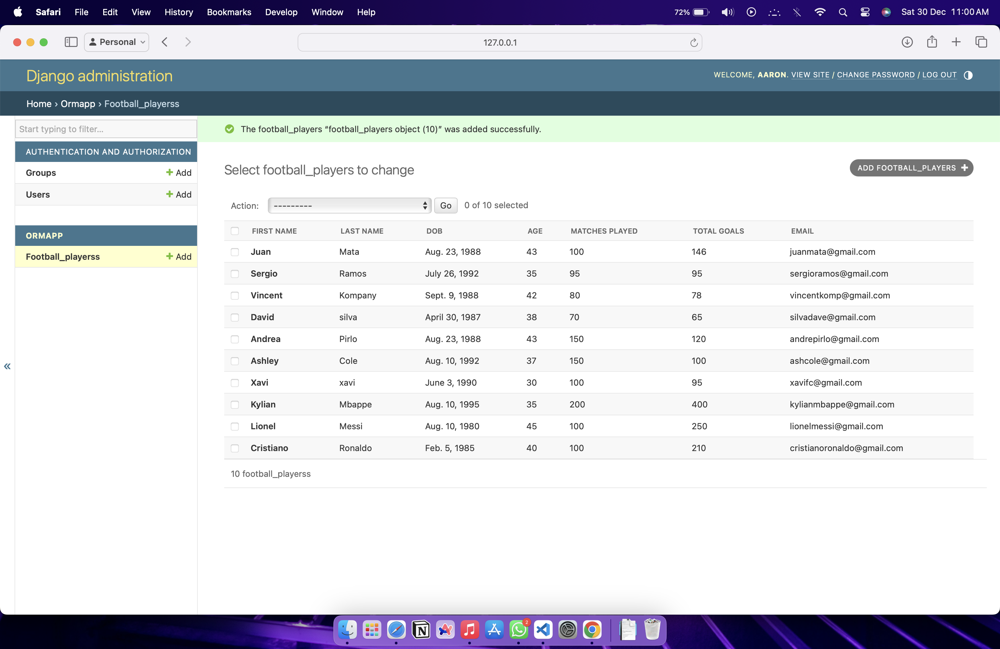

# Ex02 Django ORM Web Application
## Date: 25.10.2023

## NAME: H. AARON
## Reference no: 23012368

## AIM
To develop a Django application to store and retrieve data from a Football Players database using Object Relational Mapping(ORM).

## DESIGN STEPS

### STEP 1:
Clone the problem from GitHub

### STEP 2:
Create a new app in Django project

### STEP 3:
Enter the code for admin.py and models.py

### STEP 4:
Execute Django admin and create 10 Football players

## PROGRAM

```
admin.py

from django.contrib import admin
from .models import football_players,football_playersAdmin
admin.site.register(football_players,football_playersAdmin)

models.py

from django.db import models
from django.contrib import admin
class football_players(models.Model):
  first_name=models.CharField(max_length=30)
  last_name=models.CharField(max_length=30)
  dob=models.DateField()
  age=models.IntegerField()
  matches_played=models.IntegerField()
  total_goals=models.IntegerField()
  email=models.EmailField()

class football_playersAdmin(admin.ModelAdmin):
  list_display=('first_name','last_name','dob','age','matches_played','total_goals','email')
```

## OUTPUT



## RESULT
Thus the program for creating a database using ORM hass been executed successfully
